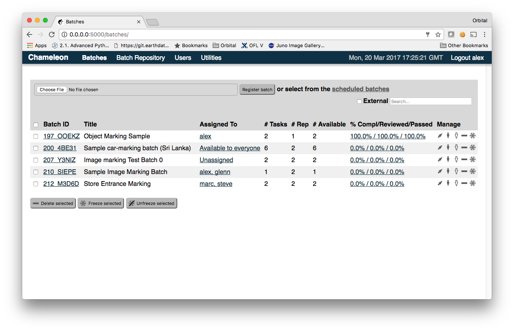

Using Chameleon
==========================================

A Chameleon user will see different user interface, depending on the user class.  There are three classes of users:

workers – mere mortals, salt of the earth;

supervisors – demigods; can assign and review work and otherwise meddle in workers' affairs;
administrators – all-powerful and all-seeing creatures of pure light, enshrouded in myth and legend.
After logging in, the home screen (Batches) will be displayed. The content of the home screen will vary depending on the user access level – worker, supervisor, or administrator. The following screenshot if of an administrator's home screen:

The content of the Batches screen is discussed in more details below.  For now, let's just focuse on the navigation bar at the top. It contains the following options:

Batches – presents users to the batches available to them and allows them to perform tasks; Chameleon administrators, can also manage batches and review work.
Batch Repository (available only to administrators) – currently this is just a list of published (completed) batches, but eventually this interface will allow some management operations to be performed on published batches.
User Management (available only to administrators) – creating new users, assigning passwords and permissions, removing users.
Utiities – a bunch of generally useful things

